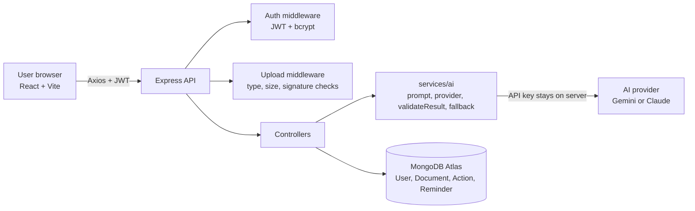
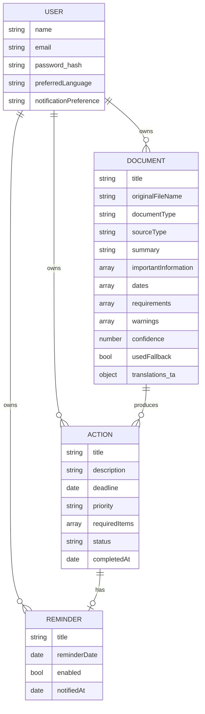

# LifeLens AI — Hackathon Documentation

**LifeLens AI — From Information to Action**
Problem statement: **AI for Everyday Life**
Core idea: **Understand → Decide → Act → Track**

---

## 1. Problem statement

People receive a constant stream of everyday information: college notices, exam circulars, bills, application forms, event announcements, public notices. The important part (what to do, by when, what to bring) is usually buried in long or complicated text, sometimes in a language the reader finds hard. As a result, people miss deadlines, overlook required documents or payments, and misread instructions.

## 2. Abstract

LifeLens AI is a web application that turns everyday documents into structured actions. A user uploads a PDF or image, takes a photo with the device camera, or pastes text. An AI model reads it and returns a validated, structured result: a plain-language summary, the important facts, dates and deadlines, required documents or payments, and a list of actions, each with a suggested priority. Every action becomes a task on a personal dashboard, where the user can adjust priority, set a reminder, and mark it done. Results can be read in English or natural Tamil. The app separates text extracted from the document from the AI's interpretation, shows "Not clearly identified" instead of guessing, and clearly labels a keyword-based fallback when the AI is unavailable. LifeLens is built on the MERN stack with a pluggable AI-provider layer, so the AI vendor can be changed without rewriting the application.

## 3. Aim

To help people act correctly and on time on the information they receive every day, by converting documents into clear tasks, deadlines, reminders, and progress tracking.

## 4. Objectives

1. Extract actions, deadlines, required items, and priorities from documents with minimal manual input.
2. Keep results trustworthy: never invent dates or requirements, and show uncertainty openly.
3. Make results accessible in English and Tamil.
4. Keep the user in control (editable priority, deletable tasks).
5. Protect privacy by not storing original uploaded files.
6. Design the architecture so email, WhatsApp, calendar, and mobile push can be added later.

## 5. Solution

| Stage | What LifeLens does |
|---|---|
| **Capture** | Upload (PDF, PNG, JPG, TXT), camera capture with preview/retake, or paste text |
| **Understand** | AI reads the content (including photos) and returns structured JSON |
| **Decide** | Priority (High / Medium / Low) is suggested from urgency, stated importance, and consequences. The user can change it |
| **Act** | Each action becomes a task with a deadline, required items, and an optional reminder |
| **Track** | Dashboard shows what needs attention today, upcoming deadlines, pending tasks by priority, and progress |

## 6. Innovation

- **The workflow after understanding.** General AI tools can summarize a document. LifeLens is purpose-built for the next question: *what should I do, by when, and have I done it?* The output is a task list, not a chat answer.
- **Honest AI.** The "Extracted from your document" panel shows only exact quotes (checked by the server against the source text for text input). The AI's summary and confidence sit in a separately labelled panel. Missing information shows as "Not clearly identified".
- **Validation before storage.** AI replies are parsed, schema-checked, and cleaned (invalid dates blanked, unknown priorities set to Medium, confidence capped at 95%) before anything is saved.
- **Real Tamil support.** The AI writes a natural Tamil version of the result in the same request; the whole interface is translated, not just labels.
- **Graceful degradation.** If the AI is unavailable, pasted text gets a deterministic keyword/date analysis labelled "AI unavailable — deterministic fallback used."
- **Privacy by design.** Original files are processed in memory and discarded; only structured results are stored.

## 7. Architecture

Rules the architecture enforces: the browser never talks to the AI directly; secrets live only in server environment variables; the AI provider is isolated in one file (`provider.js`).

**Request flow for `/api/analyze`:** upload (memory only) → validate type, size, real file signature → PDF/TXT to text, images sent to the AI as images → prompt → provider → extract JSON → validate → save document and tasks → return to the page.

## 8. Database schema

Indexes: `Document(userId, createdAt)`, `Action(userId, status, deadline)`, unique `Reminder(userId, actionId)`, unique `User(email)`.

## 9. API documentation

See the table in `README.md` (all routes, methods, and purposes). All routes except register and login require a Bearer token.

## 10. Demo script (about 2 min 30 s)

Before you start: server and client running, one account already created, the sample notice ready, browser notifications allowed, and one earlier document analyzed so the dashboard is not empty.

| Time | Do | Say |
|---|---|---|
| 0:00 | Landing page | "Everyone gets notices and bills. The important part is buried, so deadlines get missed. LifeLens turns information into action: understand, decide, act, track." |
| 0:20 | Log in, open **Analyze** | "I'll use a real college notice." |
| 0:30 | Paste the sample (or upload/capture a photo), click **Analyze document** | "I can upload a PDF, take a photo with the camera, or paste text." |
| 0:50 | Point to the result | "Left, the highlighted text is quoted straight from the document. Right, the AI's own reading, kept separate so I know what to trust." |
| 1:10 | Point to the task card | "It found one action: submit the project report, due 15 October, High priority, and I need the signed approval form. Priority is only a suggestion, so I can change it." |
| 1:25 | Click **Remind me**, save | "I set a reminder. The app notifies me while it's open, and the design allows email or push later." |
| 1:40 | Open **Dashboard** | "This answers 'what needs my attention today?': upcoming deadlines, pending by priority, and progress." |
| 1:55 | Click **தமிழ்** | "Everything switches to natural Tamil, including the AI result, so it's usable for families and students who prefer Tamil." |
| 2:10 | **My Tasks** → **Mark as done**, back to **Dashboard** | "Mark it done and progress updates. That's the full loop." |
| 2:25 | Close | "If a date isn't in the document, LifeLens says 'Not clearly identified' instead of guessing. That's information turned into action, honestly." |

**If something goes wrong live:**
- AI busy: the app retries automatically, and if it still fails it shows the labelled fallback. Say so openly: "That's the safe fallback; it tells you AI wasn't used."
- Camera blocked: use **Upload file** instead.
- Render free tier asleep: open the backend URL's `/api/health` a few minutes before the demo.

## 11. Presentation outline (10 slides)

1. **Title:** LifeLens AI — From Information to Action. Team, problem statement "AI for Everyday Life".
2. **Problem:** missed deadlines, buried instructions, complex language. One real example (a college notice).
3. **Who it helps:** students, working professionals, parents, anyone who receives notices.
4. **Idea:** Understand → Decide → Act → Track (one diagram, one sentence).
5. **How it works:** capture (upload, camera, text) → AI → structured actions → tasks and reminders.
6. **Live demo** (or screenshots): result page showing highlighted extraction beside the AI interpretation.
7. **Trust and safety:** exact-quote extraction, "Not clearly identified", validated output, labelled fallback, no stored originals, not professional advice.
8. **English + Tamil:** side-by-side screenshots of the same result.
9. **Architecture:** React → Express → AI provider; MongoDB; pluggable AI layer; deployed on Vercel, Render, Atlas.
10. **Impact and future scope:** email and WhatsApp ingestion, calendar sync, push notifications, more languages, shared family or class task lists, scanned-PDF OCR.

## 12. How it maps to judging criteria

| Criterion | Evidence in LifeLens |
|---|---|
| Innovation | Information → structured, trackable actions with honest uncertainty handling |
| Real-world usefulness | Everyday documents everyone receives; missed deadlines are a real cost |
| AI usage | Document and image understanding, extraction, classification, prioritization, Tamil generation |
| Technical implementation | Full MERN stack, JWT auth, validated AI output, pluggable provider, tests |
| User experience | Simple flow, minimal manual input, clear dashboard, loading/empty/error states |
| Accessibility | English and Tamil, keyboard-friendly, priority shown by shape and word as well as colour |
| Scalability | Provider isolated, reminder model ready for email/push, stateless API |

## 13. Likely judge questions

- **"Why not just use ChatGPT?"** General assistants can summarize documents well. LifeLens is designed around what comes after: tasks, deadlines, priorities, reminders, and progress in one place, with a consistent structured result every time.
- **"What if the AI is wrong?"** The app shows confidence (capped), separates quotes from interpretation, lets the user edit or delete anything, and tells the user to check the original. Dates are validated, and unclear ones are left as "Not clearly identified".
- **"Is my data safe?"** Passwords are hashed, access uses JWT, every query is scoped to the user, the API key stays on the server, and original files are never stored. Note that document content is sent to the AI provider for analysis.
- **"Does it work offline or when closed?"** Reminders currently fire while the app is open. The reminder model and hook are structured for server-side email or push.
- **"Can you add another AI model?"** Yes, one function in `provider.js`.

## 14. Known limitations (be upfront)

- Reminders are not delivered when the browser tab is closed.
- Scanned PDFs without a text layer must be uploaded as photos or screenshots.
- For photos, "extracted" text is the AI's reading of the image; the server cannot compare it with a source text.
- AI results can still be wrong, so always check important details against the original.
- Free-tier AI and hosting can be slow or busy (retry logic and the labelled fallback reduce the impact).

## 15. Future scope

Email and WhatsApp ingestion; Google Calendar export; push and email reminders from a scheduled job; more Indian languages; shared task lists for classes and families; OCR for scanned PDFs; an "edit AI result" step that learns from corrections; an optional mobile app.

## 16. Deployment summary

- **Database:** MongoDB Atlas (Network Access allows the host).
- **Backend:** Render Web Service, root `server`, build `npm install`, start `npm start`, env vars `MONGO_URI`, `JWT_SECRET`, `AI_API_KEY`, `AI_PROVIDER`, `AI_MODEL`, `CLIENT_URL`.
- **Frontend:** Vercel, root `client`, env var `VITE_API_URL=https://<render-service>.onrender.com/api`.
- Full steps are in the main `README.md`.
